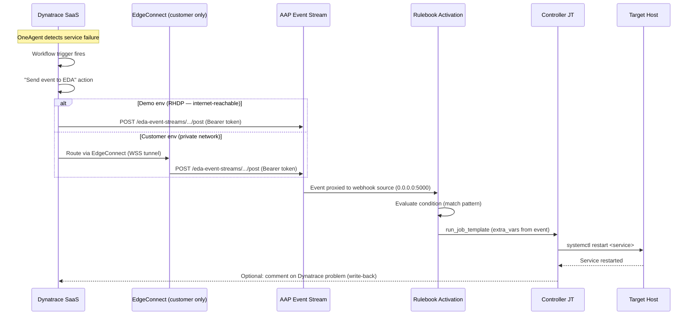

# Architecture — Push Model

## Network Flow



## Push vs Pull Comparison

```
PUSH (this repo)                         PULL (aap.eda.dynatrace)
─────────────────                        ────────────────────────
Dynatrace → AAP (inbound)               AAP → Dynatrace (outbound)
Near-real-time                           Up to delay seconds (60s default)
Event Streams (built-in)                 dt_esa_api source (custom DE)
Default DE                               Custom DE with DT collection
EdgeConnect for private nets             Not needed
dtctl CaC for DT side                    N/A
Workflow + Connector config              API token only
```

## Component Inventory

| Component | Location | Purpose |
|-----------|----------|---------|
| **Dynatrace Workflow** | `dynatrace/workflow-service-failure.yaml` | Triggers on problem, sends event to EDA |
| **EDA Connection** | `dynatrace/eda-connection.yaml` | Points Dynatrace at the AAP Event Stream URL |
| **Event Stream** | `aap_config/files/eda_event_streams.yml` | Receives + authenticates inbound events |
| **Token Credential** | `aap_config/files/eda_credentials.yml` | Validates the Bearer token |
| **Rulebook** | `rulebooks/dynatrace_push_events.yml` | Evaluates conditions, fires JT |
| **Activation** | `aap_config/files/eda_rulebook_activations.yml` | Wires Event Stream → rulebook |
| **Notify Playbook** | `playbooks/notify_push_event.yml` | Phase 1: log the event, no remediation |
| **Restart Playbook** | `playbooks/restart_service.yml` | Phase 4: restart failed service |

## Connectivity Requirements

| From | To | Protocol | Port | Notes |
|------|----|----------|------|-------|
| Dynatrace SaaS | AAP Event Stream endpoint | HTTPS | 443 | Direct (demo) or via EdgeConnect (customer) |
| EdgeConnect | Dynatrace SaaS (`*.apps.dynatrace.com`) | WSS | 443 | Outbound-only from customer network |
| EdgeConnect | Dynatrace SSO (`sso.dynatrace.com`) | HTTPS | 443 | OAuth2 token retrieval |
| AAP Controller | Target hosts | SSH | 22 | For remediation playbooks (Phase 4) |
